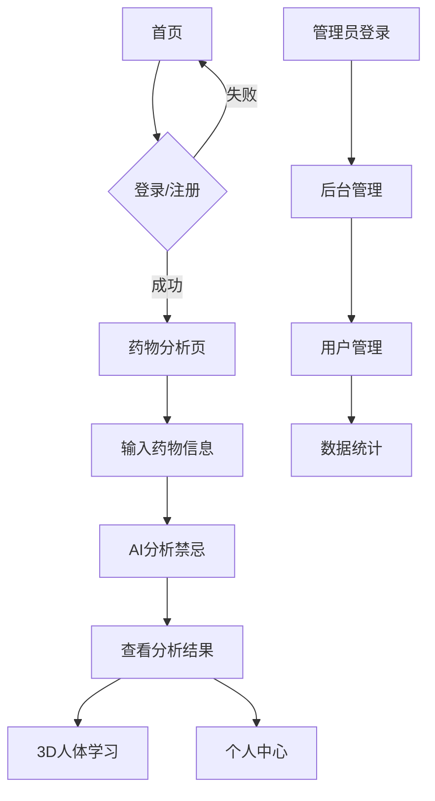

## 1. 产品概述

AI体质分析与药物禁忌规避系统，通过人工智能技术精准分析用户体质特征，智能识别药物禁忌，保障用药安全。主要服务于关注健康养生的用户群体和医疗从业者，解决传统用药咨询效率低、个性化不足的问题。

## 2. 核心功能

### 2.1 用户角色

| 角色   | 注册方式     | 核心权限                  |
| ---- | -------- | --------------------- |
| 普通用户 | 手机号/邮箱注册 | 体质分析、药物查询、3D学习、个人信息管理 |
| 管理员  | 后台创建     | 用户管理、系统设置、数据统计分析      |

### 2.2 功能模块

系统包含以下主要页面：

1. **首页/登录页**：系统介绍、用户认证入口
2. **药物禁忌分析页**：核心功能，AI分析药物禁忌
3. **3D人体器官经脉图页**：可视化学习人体经络知识
4. **后台用户管理页**：管理员操作用户数据

### 2.3 页面详情

| 页面名称    | 模块名称  | 功能描述                 |
| ------- | ----- | -------------------- |
| 首页/登录页  | 顶部导航  | 展示Logo、登录/注册按钮、主导航菜单 |
| 首页/登录页  | 宣传区域  | 系统宣传图、核心卖点展示、快速入口按钮  |
| 首页/登录页  | 认证表单  | 登录/注册切换表单，支持验证码登录    |
| 首页/登录页  | 底部信息  | 版权信息、隐私政策、联系方式       |
| 药物禁忌分析页 | 全局导航  | 主导航+药物搜索框            |
| 药物禁忌分析页 | 体质标签  | 显示用户当前体质类型           |
| 药物禁忌分析页 | 药物输入  | 药物名称输入、体质关联选择、分析按钮   |
| 药物禁忌分析页 | 分析结果  | 药物基本信息、三类禁忌结果展示      |
| 药物禁忌分析页 | 交互功能  | 结果反馈、收藏分享、相关推荐       |
| 3D人体图页  | 3D控制器 | 旋转缩放复位、经脉显示控制        |
| 3D人体图页  | 3D画布  | Three.js渲染人体模型、器官交互  |
| 3D人体图页  | 知识抽屉  | 点击器官显示相关知识弹窗         |
| 后台管理页   | 后台导航  | 仪表盘、用户管理等功能入口        |
| 后台管理页   | 用户筛选  | 多条件筛选用户数据            |
| 后台管理页   | 用户列表  | 表格展示用户信息、操作按钮        |
| 后台管理页   | 快捷操作  | 新增导出等批量操作功能          |

## 3. 核心流程

### 普通用户流程

用户访问首页 → 注册/登录 → 进入药物分析页面 → 输入药物信息 → 获取AI分析结果 → 查看3D人体知识 → 个人中心管理

### 管理员流程

管理员登录 → 进入后台管理 → 用户数据筛选查看 → 用户状态管理 → 系统配置维护

## 4. 用户界面设计

### 4.1 设计风格

* **主色调**：白色（80%）- 背景主色，营造干净简洁感

* **辅助色**：绿色（10%）- 强调色，用于按钮、重要提示

* **对比色**：黑色（10%）- 文字、边框，确保可读性

* **按钮样式**：圆角矩形，悬停变色效果

* **字体**：系统默认字体，标题16-18px，正文14px

* **布局风格**：卡片式布局，分区明确，留白充足

* **图标风格**：线性图标，简洁现代

### 4.2 页面设计概述

| 页面名称 | 模块名称 | UI元素                            |
| ---- | ---- | ------------------------------- |
| 首页   | 顶部导航 | Logo左对齐，登录按钮右对齐，导航菜单居中，白色背景绿色按钮 |
| 首页   | 宣传区域 | 左侧60%大图背景，绿色渐变遮罩，白色大标题，绿色行动按钮   |
| 首页   | 认证表单 | 右侧40%白色卡片，圆角边框，绿色提交按钮，支持切换标签    |
| 分析页  | 顶部导航 | 黑色文字导航，绿色搜索框，白色背景               |
| 分析页  | 输入区域 | 白色卡片容器，绿色分析按钮，输入框带绿色边框          |
| 分析页  | 结果展示 | 分栏卡片布局，绿色标题栏，白色内容区，红色警示文字       |
| 3D页面 | 控制器  | 顶部黑色工具栏，白色半透明按钮，绿色激活状态          |
| 3D页面 | 模型展示 | 全屏黑色背景，绿色荧光经络线，白色器官模型           |
| 后台页  | 导航栏  | 深色侧边栏，白色文字，绿色选中状态               |
| 后台页  | 数据表格 | 白色背景，绿色表头，灰色交替行，黑色文字            |

### 4.3 响应式设计

* **桌面端优先**：1920×1080为基准设计

* **移动端适配**：375×667基准，流式布局

* **断点设置**：768px、1024px、1200px

* **触摸优化**：移动端增大点击区域，支持滑动手势

### 4.4 3D场景指导

* **环境设置**：医疗科技风格，冷色调环境光

* **光照配置**：主光源+补光+轮廓光，柔和阴影

* **相机控制**：45度俯视角度，支持360度旋转

* **交互设计**：器官高亮显示，点击弹出详情面板

* **性能优化**：模型简化，纹理压缩，LOD设置

