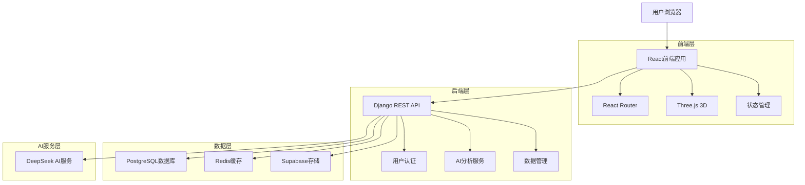
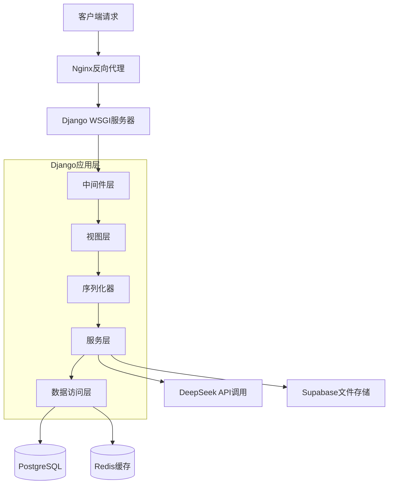
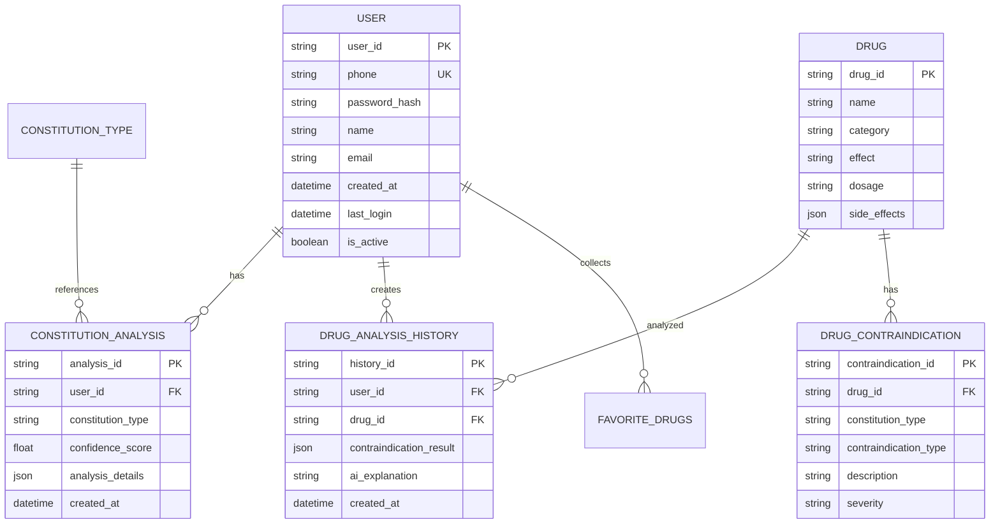

## 1. 架构设计



## 2. 技术描述

- **前端**: React@18 + TypeScript + Vite + Tailwind CSS
- **初始化工具**: create-vite
- **后端**: Django@4.2 + Django REST Framework
- **数据库**: PostgreSQL@14 + Redis@7
- **AI服务**: DeepSeek API + RAG检索增强
- **3D渲染**: Three.js + React Three Fiber
- **文件存储**: Supabase Storage
- **状态管理**: React Context + useReducer
- **UI组件**: Ant Design + 自定义组件

## 3. 路由定义

| 路由 | 用途 |
|------|------|
| / | 首页，展示系统介绍和登录入口 |
| /login | 登录页面，用户身份验证 |
| /register | 注册页面，新用户注册 |
| /analysis | 药物禁忌分析页面，核心功能 |
| /3d-body | 3D人体器官经脉图页面 |
| /profile | 个人中心，用户信息管理 |
| /admin | 后台管理首页 |
| /admin/users | 用户管理页面 |
| /admin/dashboard | 数据仪表盘 |
| /help | 帮助中心 |

## 4. API定义

### 4.1 认证相关API

**用户注册**
```
POST /api/auth/register
```

请求参数：
| 参数名 | 类型 | 必填 | 描述 |
|--------|------|------|------|
| phone | string | 是 | 手机号 |
| password | string | 是 | 密码 |
| sms_code | string | 是 | 短信验证码 |

响应：
```json
{
  "success": true,
  "data": {
    "user_id": "12345",
    "token": "jwt_token_string"
  }
}
```

**用户登录**
```
POST /api/auth/login
```

请求参数：
| 参数名 | 类型 | 必填 | 描述 |
|--------|------|------|------|
| phone | string | 是 | 手机号 |
| password | string | 是 | 密码 |

### 4.2 体质分析API

**获取用户体质**
```
GET /api/constitution/current
```

响应：
```json
{
  "success": true,
  "data": {
    "constitution_type": "阴虚体质",
    "analysis_date": "2024-01-15",
    "confidence_score": 0.85
  }
}
```

**药物禁忌分析**
```
POST /api/analysis/drug-contraindication
```

请求参数：
| 参数名 | 类型 | 必填 | 描述 |
|--------|------|------|------|
| drug_name | string | 是 | 药物名称 |
| constitution_types | array | 否 | 体质类型列表 |
| user_id | string | 是 | 用户ID |

响应：
```json
{
  "success": true,
  "data": {
    "drug_info": {
      "name": "阿司匹林",
      "effect": "解热镇痛",
      "dosage": "成人一次300-600mg"
    },
    "contraindications": {
      "constitution": ["阴虚体质慎用"],
      "compatibility": ["与抗凝药物合用增加出血风险"],
      "special_groups": ["孕妇禁用", "哺乳期慎用"]
    },
    "ai_explanation": "基于您的体质特征和药物成分分析..."
  }
}
```

### 4.3 3D模型API

**获取器官数据**
```
GET /api/3d/organs/{organ_id}
```

响应：
```json
{
  "success": true,
  "data": {
    "organ_id": "heart",
    "name": "心脏",
    "meridians": ["手少阴心经"],
    "drug_contraindications": ["心脏病患者慎用XX药物"],
    "constitution_effects": ["阳虚体质易影响心脏功能"]
  }
}
```

## 5. 服务器架构图



## 6. 数据模型

### 6.1 数据模型定义



### 6.2 数据定义语言

**用户表**
```sql
CREATE TABLE users (
    id UUID PRIMARY KEY DEFAULT gen_random_uuid(),
    phone VARCHAR(11) UNIQUE NOT NULL,
    password_hash VARCHAR(255) NOT NULL,
    name VARCHAR(100),
    email VARCHAR(255),
    is_active BOOLEAN DEFAULT true,
    created_at TIMESTAMP WITH TIME ZONE DEFAULT NOW(),
    updated_at TIMESTAMP WITH TIME ZONE DEFAULT NOW()
);

CREATE INDEX idx_users_phone ON users(phone);
CREATE INDEX idx_users_created_at ON users(created_at);
```

**体质分析记录表**
```sql
CREATE TABLE constitution_analyses (
    id UUID PRIMARY KEY DEFAULT gen_random_uuid(),
    user_id UUID REFERENCES users(id) ON DELETE CASCADE,
    constitution_type VARCHAR(50) NOT NULL,
    confidence_score FLOAT NOT NULL,
    analysis_details JSONB,
    created_at TIMESTAMP WITH TIME ZONE DEFAULT NOW()
);

CREATE INDEX idx_constitution_user_id ON constitution_analyses(user_id);
CREATE INDEX idx_constitution_created_at ON constitution_analyses(created_at DESC);
```

**药物分析历史表**
```sql
CREATE TABLE drug_analysis_history (
    id UUID PRIMARY KEY DEFAULT gen_random_uuid(),
    user_id UUID REFERENCES users(id) ON DELETE CASCADE,
    drug_name VARCHAR(200) NOT NULL,
    constitution_types TEXT[],
    contraindication_result JSONB,
    ai_explanation TEXT,
    created_at TIMESTAMP WITH TIME ZONE DEFAULT NOW()
);

CREATE INDEX idx_drug_history_user_id ON drug_analysis_history(user_id);
CREATE INDEX idx_drug_history_created_at ON drug_analysis_history(created_at DESC);
CREATE INDEX idx_drug_history_drug_name ON drug_analysis_history(drug_name);
```

**用户收藏表**
```sql
CREATE TABLE user_favorites (
    id UUID PRIMARY KEY DEFAULT gen_random_uuid(),
    user_id UUID REFERENCES users(id) ON DELETE CASCADE,
    drug_name VARCHAR(200) NOT NULL,
    created_at TIMESTAMP WITH TIME ZONE DEFAULT NOW(),
    UNIQUE(user_id, drug_name)
);

CREATE INDEX idx_favorites_user_id ON user_favorites(user_id);
```

**管理员表**
```sql
CREATE TABLE admins (
    id UUID PRIMARY KEY DEFAULT gen_random_uuid(),
    username VARCHAR(50) UNIQUE NOT NULL,
    password_hash VARCHAR(255) NOT NULL,
    role VARCHAR(20) DEFAULT 'admin',
    is_active BOOLEAN DEFAULT true,
    created_at TIMESTAMP WITH TIME ZONE DEFAULT NOW()
);

-- 初始管理员数据
INSERT INTO admins (username, password_hash) VALUES 
('admin', 'pbkdf2_sha256$...');  -- 实际使用时需要加密密码
```